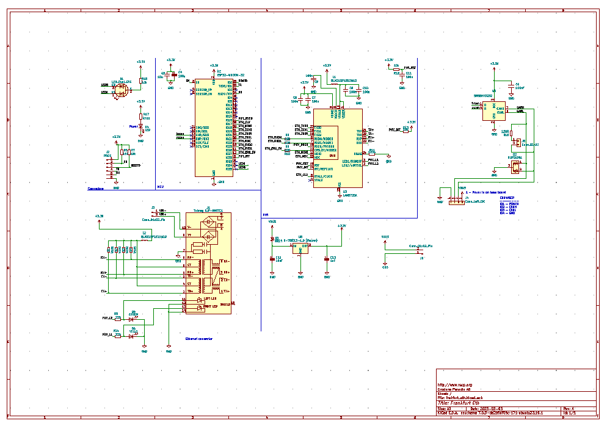

<h1>CAN4VSCP Frankfurt Eth (PoE)</h1>

This work is based on original work done [here](https://github.com/nuclearcat/ESP32ETH). 

**Frankfurt Eth** is a tcp/ip and MQTT CAN4VSCP gateway. The module is available in two versions. One without PoE and and with PoE.

The module is plug and play. Just connect to a CAN4VSCP system and go to work. You can connect to the module using [VSCP tcp/ip link protocol](https://grodansparadis.github.io/vscp-doc-spec/#/./vscp_tcpiplink) or set it up to talk to a MQTT broker of choice.

Nota that this is **not** a CAN <-> tcp/ip (or MQTT) gateway as it only speaks [VSCP](https://grodansparadis.github.io/vscp-doc-spec). It is possible though to load firmware into it to create a standard CAN (not CAN FD) <-> tcp/ip gateway. 

The project uses an ESP32 Wroom module. It utilize Ethernet instead of Wifi/Bluetooth. Ethernet interface is provided with a LAN8720A and CAN is provided by the ESP32 support for TWAI. The module is powered from the [CAN4VSCP bus](https://grodansparadis.github.io/vscp-doc-spec/#/./vscp_over_can_can4vscp) (or PoE).  When powered from PoE the module can provide power for other CAN4VSCP modules. CAN4VSCP power is in the range +9V - 28V.

The intended use is to connect a remote CAN4VSCP bus to a central system or to connect two or more CAN4VSCP networks together. 

If Wifi is required instead of Ethernet the [CAN4VSCP Frankfurt Wifi module](https://github.com/grodansparadis/can4vscp-frankfurt-wifi) is available that can do that.

## Schema

### Standard version

### PoE version

## Standard version

## PoE Version

Please support the <a href="http://www.vscp.org">VSCP development</a>. The best way to support the project is 
to buy something from the <a href="http://www.frogshop.se">FrogShop</a>. If you want to contribute money use the button
 at the end of the <a href="http://www.vscp.org">VSCP sites</a> start page.

Visit our <a href="http://www.vscp.org/wiki/doku.php/sponsors">sponsor page</a> for all options.

Part of the VSCP Project.

Copyright 2018-2023 © Åke Hedman, (Grodans Paradis AB)[https://www.grodansparadis.com]

